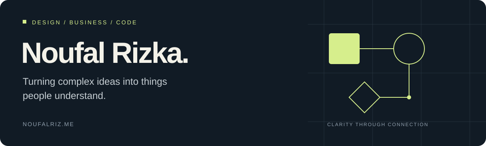

  

  <a href="https://www.noufalriz.me/"><strong>Portfolio</strong></a> &nbsp; / &nbsp;
  <a href="https://www.linkedin.com/in/noufalriz/"><strong>LinkedIn</strong></a> &nbsp; / &nbsp;
  <a href="https://www.behance.net/noufalriz"><strong>Behance</strong></a> &nbsp; / &nbsp;
  <a href="mailto:creative.noriz@gmail.com"><strong>Email</strong></a>

## Hi, I'm Noufal Rizka.

I'm a **graphic and product designer with a background in business administration**, working across brand strategy, digital experiences, and practical analytical tools. My work has taken me from Indonesia to Türkiye and into collaborations across Europe, connecting business questions with visual communication and technology.

I care about how people understand things: a product journey, an industrial proposal, a financial dashboard, or a research finding. Sometimes that calls for an identity system. Sometimes it calls for an interface or a Python pipeline. The starting point is the same: understand the problem, give it structure, and make the result useful.

Here on GitHub, I share the software side of that practice: **personal finance tools, decision-support applications, and research automation**. My [portfolio](https://www.noufalriz.me/) tells the design and strategy side.

> **Every frame tells a story. Every story solves through design.**

## Selected software projects

### Finance Journal

**Bringing financial reasoning into everyday money decisions.**

A personal treasury and portfolio journal connecting cash-flow tracking, multi-currency spending, and investment analysis. Built around questions I encounter while studying finance: what did I consume, where did my cash move, and how much investment growth came from returns rather than contributions?

- Separates spending from transfers and investment funding.
- Distinguishes historical expense conversions from the current currency value of cash.
- Explores portfolio valuations, cash-flow-adjusted performance, and the assumptions behind risk measures.
- Offers a public demo with fictional records and session-only data.

**Built with:** TypeScript · Next.js · PostgreSQL · React · Tailwind CSS · Recharts

[Explore the code](https://github.com/nouseeme/personal-Treasury-and-Portfolio-journal) · [Try the public demo](https://public-preview-finance-journal.vercel.app/)

### TalkBank Speech Analysis

**Turning repeated research tasks into a reproducible workflow.**

A Python pipeline supporting a study of Turkish learners' discourse-marker use across weeks and proficiency levels. The original corpus comprised **120 transcripts, 10 participants, two proficiency levels, and 13 dictionary categories**.

- Converts prepared Word transcripts into CHAT format.
- Counts dictionary-defined expressions in learner speech and aggregates results by participant, level, and week.
- Produces charts, Word reports, CSV tables, and optional JSON for further analysis.
- Includes a synthetic public example while keeping the original research corpus private.

**Built with:** Python · pandas · Matplotlib · python-docx · Jupyter

[Explore the code and methodology](https://github.com/nouseeme/talkbank-speech-discourse-analysis)

### AHP Matrix Calculator

**Making the reasoning behind a decision visible.**

A web application for the Analytic Hierarchy Process: translating pairwise comparisons into priority weights, checking judgment consistency, and comparing alternatives across multiple criteria.

**Built with:** JavaScript · React · CSS

[Explore the code](https://github.com/nouseeme/AHP-Matrix-Calculator-for-Decision-Making) · [Try the calculator](https://ahp.noufalriz.me/)

## Design, strategy & work beyond GitHub

**3rd place — NSosyal SuperApp Creathon, TEKNOFEST Istanbul 2025** 
As team lead, I worked across product direction and UI/UX during a 36-hour design marathon. Our concept connected social discovery, commerce, messaging, mobility, and payments into a shared user journey. [Read the case study →](https://www.noufalriz.me/works/teknofest-2025)

| Project | My contribution |
| --- | --- |
| **[VeltaQ](https://www.noufalriz.me/works/veltaq)** · Food automation | Structured technical proposals, presentations, diagrams, and sales communication to help clients understand complete production systems, including proposals exceeding €200K. |
| **[BOXTUO](https://www.noufalriz.me/works/boxtuo)** · Modular construction | Creative direction and a modular brand identity, with proposal and outreach materials for markets including Poland, Slovakia, China, and Latin America. |
| **[STAIRMAX](https://www.noufalriz.me/works/stairmax)** · Industrial access systems | Led the design of a visual identity spanning the logo, technical documents, proposal decks, brochures, and trade fair materials. |
| **[Elkahvesi](https://www.noufalriz.me/works/elkahvesi)** · Coffee | Designed a logo and brand identity using hand-drawn illustration, playful typography, and packaging built around the grab-and-go experience. |

My experience also includes **Head of Creative Media at PPI Turki**, **Core Team Designer at Google Developer Student Club in Bartın**, graphic design at **MekanoX Polska**, and branding strategy for **XTEEL**.

## What I bring to a project

| Area | How it shows up in my work |
| --- | --- |
| **Product & experience design** | Framing problems, mapping user journeys, connecting services, and shaping interfaces around how people actually use them. |
| **Brand & visual communication** | Identity systems, information hierarchy, technical storytelling, and consistent communication across markets. |
| **Business & financial reasoning** | Connecting design decisions to business needs; exploring cash flow, currency effects, investment performance, and decision models. |
| **Web development** | Building interactive tools with TypeScript, JavaScript, React, Next.js, and Tailwind CSS. |
| **Research & data** | Using Python, pandas, Matplotlib, and document automation to turn structured inputs into inspectable analysis and reports. |

## Education & learning

- **Business Administration** — bachelor's studies at Bartın University, Türkiye.
- **Business Management** — Erasmus+ program at the University of Łódź, Poland.
- **McKinsey Forward Program** — McKinsey.org.

The connection across my work is curiosity about systems: how a business communicates its value, how services fit together, and how data becomes something a person can act on.

---

  <strong>Have a product, brand, or analytical problem to work through?</strong> 
  <a href="mailto:creative.noriz@gmail.com">Let's talk</a> ·
  <a href="https://www.linkedin.com/in/noufalriz/">Connect on LinkedIn</a> ·
  <a href="https://www.noufalriz.me/">See my full portfolio</a>

